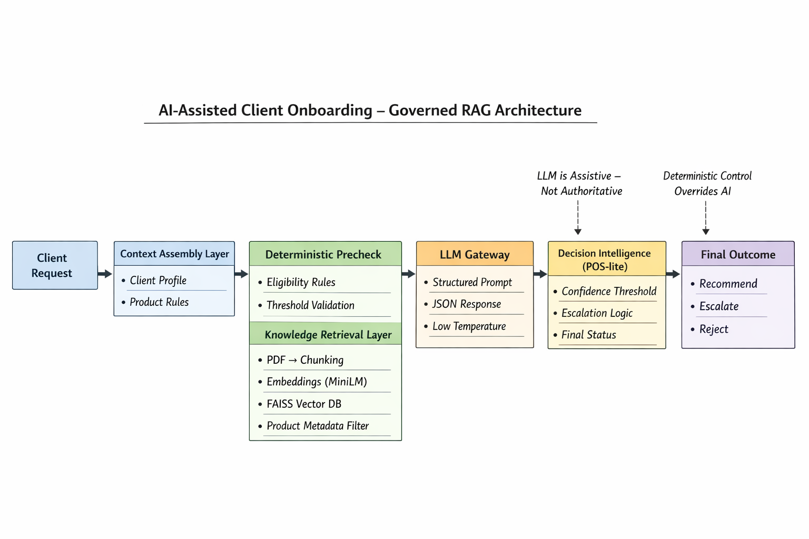

# AI-Assisted Client Onboarding  
## Governed RAG Architecture (Reference Implementation)

---

##  Overview

Banks and regulated financial institutions face increasing complexity in client onboarding and product eligibility decisions due to evolving policies, risk constraints, pricing structures, and compliance requirements.

This project presents a **governance-first, AI-assisted enterprise architecture** demonstrating how probabilistic AI can be safely integrated into regulated workflows — without compromising accountability, explainability, or decision ownership.

The system is intentionally designed as a **reference implementation**, emphasizing architectural discipline and production-style patterns rather than experimental automation.

---

##  Core Design Principles

- AI assists decisions; it does not make them  
- Models are probabilistic reasoning components, not authorities  
- Data governance precedes AI reasoning  
- Human accountability remains explicit and auditable  
- Learning is controlled and offline — not autonomous  

---

## 🔄 High-Level Architecture

Client Request
↓
Context Assembly Layer
↓
Deterministic Precheck
↓
Knowledge Retrieval
(Vector DB + Metadata Filter)
↓
LLM Reasoning Service
(Structured JSON Output)
↓
Decision Intelligence Layer (POS-lite)
↓
Final Outcome
(Recommend / Escalate / Reject)

---

### Architecture Diagram

*Governance-first architecture integrating deterministic controls, hybrid retrieval, struc

##  Key Architectural Components

### 1️ Context Assembly Layer
- Retrieves only relevant policy and client data  
- Applies masking and access controls  
- Produces curated context artifact for AI reasoning  

### 2️ Knowledge Retrieval Layer
- PDF ingestion & chunking  
- SentenceTransformer embeddings  
- FAISS vector index  
- Product-level metadata filtering  
- Hybrid semantic retrieval  

### 3️ LLM Reasoning Service
- Invoked via controlled API  
- Receives curated context (not raw enterprise data)  
- Produces structured candidate recommendations (JSON only)  
- Temperature-controlled inference  

### 4️ Decision Intelligence Layer (POS-inspired)
- Applies deterministic business rules  
- Enforces approval limits and escalation paths  
- Implements confidence threshold gating  
- Supports human-in-the-loop override capability  

### 5️ Audit & Feedback
- Full traceability of inputs and outputs  
- Explicit capture of overrides  
- Supports offline evaluation  
- No autonomous learning loop  

---

## Technology Stack

- Python 3.13  
- SentenceTransformers (`all-MiniLM-L6-v2`)  
- FAISS (Vector Index)  
- OpenAI API (Structured Invocation)  
- RecursiveCharacterTextSplitter  
- Custom Deterministic Rule Engine  
- JSON-safe parsing  

---

## Governance Controls

- No raw PII is sent to the LLM  
- Deterministic rule override precedence  
- Structured JSON enforcement  
- Confidence threshold-based escalation  
- Human decision ownership retained  

---

## How to Run

### 1️ Install dependencies

pip install -r requirements.txt

### 2️ Create .env file

OPENAI_API_KEY=your_api_key_here

### 3 Build vector knowledge base

python build_knowledge_base.py

### 4️ Run onboarding flow

python run_context_test.py

---

##  What This Project Is — and Is Not

### This project is:

- An enterprise AI architecture proposal  
- A governance-first design pattern  
- A structured RAG + decision intelligence reference implementation  

### This project is not:

- A fully automated approval engine  
- A chatbot demo  
- A production deployment claim  
- An autonomous AI decision system  

---

##  Intended Audience

- Enterprise Architects  
- AI Governance & Risk Leaders  
- CAIO / CTO stakeholders  
- Senior Engineering Leadership  

---

##  Repository Structure

ai-assisted-client-onboarding/
│
├── README.md
├── architecture/
├── data/
│ ├── clients/
│ └── policies/
├── services/
│ ├── context_assembly/
│ ├── knowledge_ingestion/
│ ├── llm_gateway/
│ ├── decision_engine/
│ └── audit/
├── build_knowledge_base.py
└── run_context_test.py

---

##  Status

Reference implementation — architecture validated.

